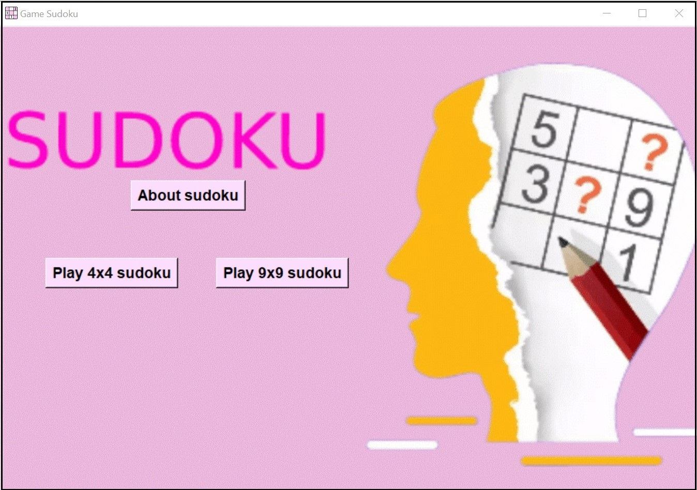
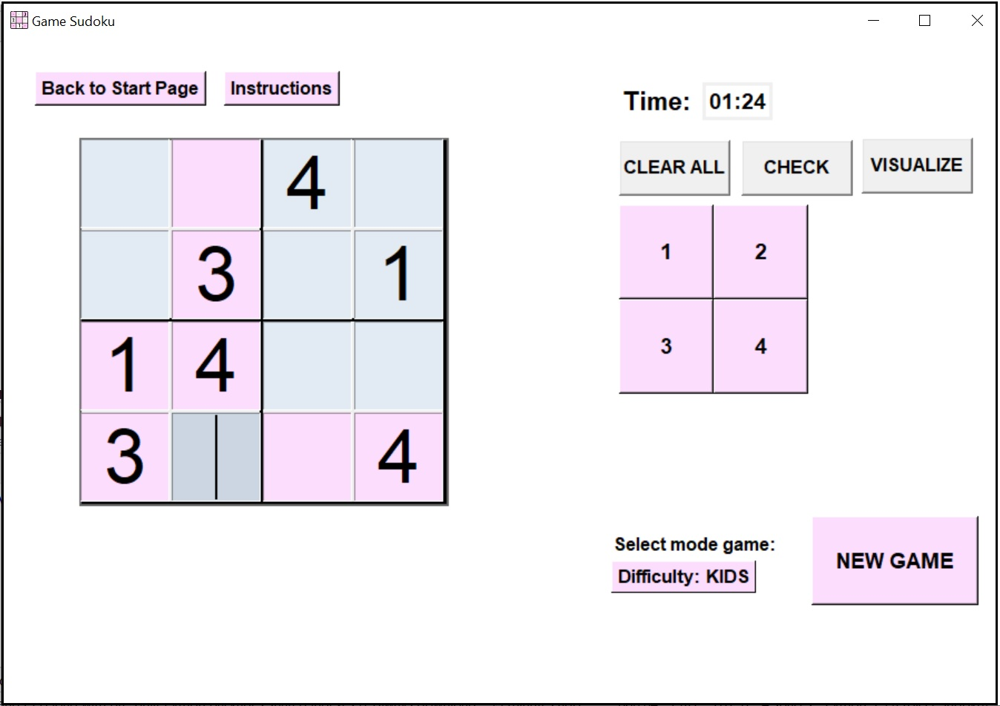
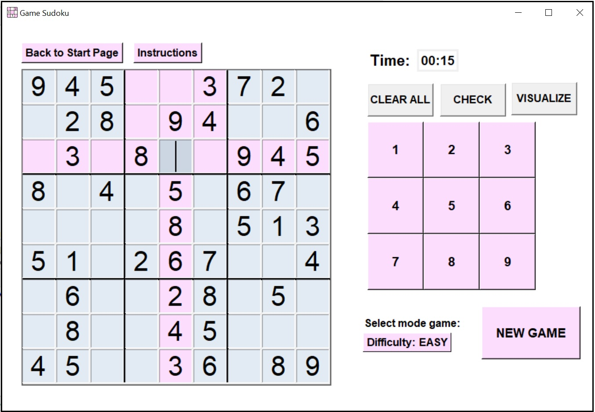

# Python-Sudoku-Backtracking-App

**This application was developed as the main project for my Bachelor’s thesis titled ‘Backtracking Technique: Algorithms and Applications.**  

## Sudoku Game Overview  
The classic Sudoku game consists of completing a **9 × 9 grid squares, which is divided into 3 × 3 squares.** The goal of the game is to fill each cell with a number from 1 to 9, ensuring that no numbers are repeated in any row or column of the grid, nor within each 3 × 3 square. The game starts with a partially filled grid containing a certain number of randomly given values that satisfy the problem's restrictions.
The player must find the remaining numbers based on the positions of the numbers already given. Thus, the Sudoku game can be played in different variants, ranging from very easy to very difficult, with solving times varying from a few minutes to several hours. The difficulty of each puzzle depends on the number of cells filled at the start of the game. Therefore, even if the game has simple rules, solving it is a high one, being arranged on several levels of difficulty.  

The application also provides a version of **the game for children, with 4 × 4 grids divided into 2 × 2 squares.** The rules for this variant are the same as for the 9 × 9 grids, except that each cell must contain a number from 1 to 4. The graphical interface of the Sudoku game is built in **Python using the Tkinter library.** The game opens with a main Frame type window containing three buttons: one button provides information about the Sudoku game, while the other two buttons allow the user to select the grid they want to play, namely the **_Play 4×4 Sudoku button_** and the **_Play 9×9 Sudoku button_** (see the image below).  

### <b>Start Page App</b>

### <b>The interface of the children's game 4x4 and the classic game 9X9</b>
 

