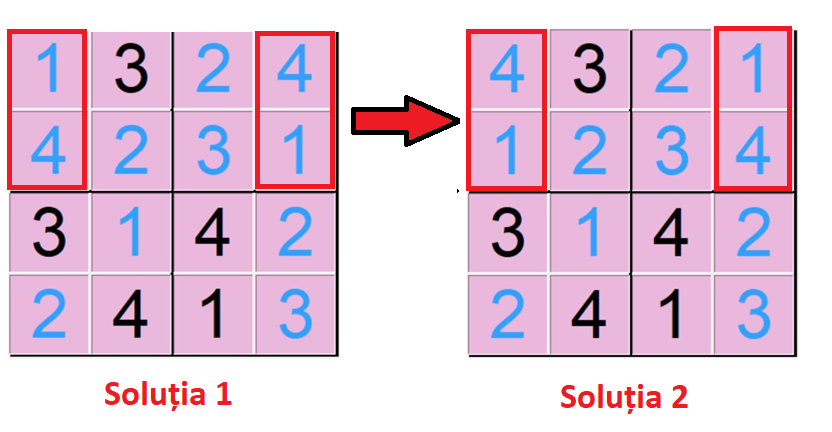
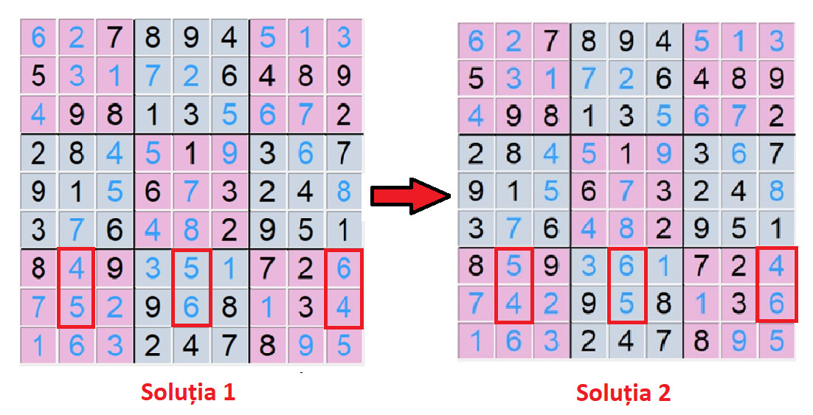

# Python-Sudoku-Backtracking-App

**This application was developed as the main project for my Bachelor’s thesis titled ‘Backtracking Technique: Algorithms and Applications.**  

## Sudoku Game Overview  
The classic Sudoku game consists of completing a **9 × 9 grid squares, which is divided into 3 × 3 squares.** The goal of the game is to fill each cell with a number from 1 to 9, ensuring that no numbers are repeated in any row or column of the grid, nor within each 3 × 3 square. The game starts with a partially filled grid containing a certain number of randomly given values that satisfy the problem's restrictions.
The player must find the remaining numbers based on the positions of the numbers already given. Thus, the Sudoku game can be played in different variants, ranging from very easy to very difficult, with solving times varying from a few minutes to several hours. The difficulty of each puzzle depends on the number of cells filled at the start of the game. Therefore, even if the game has simple rules, solving it is a high one, being arranged on several levels of difficulty.  

The application also provides a version of **the game for children, with 4 × 4 grids divided into 2 × 2 squares.** The rules for this variant are the same as for the 9 × 9 grids, except that each cell must contain a number from 1 to 4. The graphical interface of the Sudoku game is built in **Python using the Tkinter library.** The game opens with a main Frame type window containing three buttons: one button provides information about the Sudoku game, while the other two buttons allow the user to select the grid they want to play, namely the **_Play 4×4 Sudoku button_** and the **_Play 9×9 Sudoku button_** (see the image below).  
### <b>Start Page App</b>
  

Once the user has selected the type of game, a new Frame window opens, containing an empty game board, a menu to choose the game’s difficulty, a **NEW GAME** button that generates a random game board according to the selected difficulty, and a digital clock that starts when the game begins. The window also includes a **CLEAR** button, which removes all values from the game grid, a **CHECK** button that allows the user to verify whether the grid they have completed is correct, displaying an appropriate message, and a **VISUALIZE** button, which visually shows the solution of the game grid using the backtracking algorithm.  

The algorithm is implemented in the file `sudoku.py` in the function `visualize_backtracking_soln()`. This recursive algorithm fills the empty cells of the game grid with numerical values from 1 to 4 or from 1 to 9, depending on the chosen game option. The algorithm works as follows: first, it searches for an empty cell and tries to fill it with a random number from the list of available numbers. Then, it checks whether the chosen number satisfies all Sudoku rules. This verification is performed using the functions `find_empty_cell()` and `is_consistent()` located in the file `sudoku_functions.py`.
* If the number is valid, it remains in the cell, and the algorithm continues recursively to the next empty cells until the entire grid is completed, at which point the algorithm ends and a solution is obtained.  
* If the chosen number does not satisfy the rules of the game, the next available number is tried.  
* When there are no more numbers available for that box, the algorithm backtracks to search for a new empty cell in the grid.

Therefore, for the classic version of the Sudoku game, the user can choose one of the three difficulty levels: **Easy, Medium, Hard**. The application also provides a children's version of the game with 4×4 grids, divided into 2×2 squares.

### <b>The interface of the children's game 4x4:</b>
  

### <b>The interface of the classic game 9X9:</b>

## The Backtracking Technique in Solving Sudoku Problems
As mentioned above, the application is based on the backtracking technique, which also highlights the visualization of all possible solutions for a 9 × 9 or 4 × 4 game grid (see the images below).

### <b>All Solutions for a 4×4 Kids’ Sudoku variant:</b>
  

### <b>All Solutions for a 9×9 Sudoku variant:</b>
  
